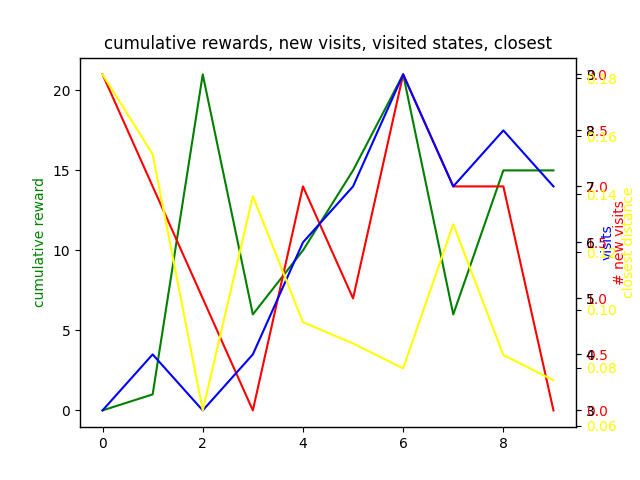

## Simulated Robot
### Dumb RL
Tabular Monte Carlo: the state/observation space (`obs_vector`) is a truncated x,y,z position (to the tenths digit). Actions are a choice of -0.1, 0, or 0.1 (velocities) for each of the 6 relevant joints (a gripper joint is omitted). Rewards are given by how close the gripper (end effector) is to the cube in a graded manner.

Un-tuned, 10 episodes, gamma=0.99:
```
python3 dumb_rl.py
```

The yellow line is what we care about (closest distance to the cube), but the visualization of the simulation suggests that distance becomes less important as we move closer, since the eef is fairly huge (can it even get closer than grade 7?). It's bumping into the table and maybe trying to twist itself to get closer (?).

### Vision-based
Detects object positions (cube and eef) not very accurately.
```
python3 vision_grab.py
```
Change line 106 (main's header) to show/hide simulation rendering or camera. 

## Real Robot (WIP)
1. Download the python wheel [here](https://artifactory.kinovaapps.com/ui/repos/tree/General/generic-public/kortex/API/2.2.0/kortex_api-2.2.0.post31-py3-none-any.whl)
2. `pip install <path_to_that_download>`
(The above is covered by the Kortex [repo](https://github.com/Kinovarobotics/Kinova-kortex2_Gen3_G3L/tree/master/api_python/examples)
3. [Examples](`git clone https://github.com/Kinovarobotics/Kinova-kortex2_Gen3_G3L`) 


### Requirements (for vision)
`pip install torch, torchvision, pycocotools`

### Acknowledgements
@software{yolov5,
 title = {Ultralytics YOLOv5},
 author = {Glenn Jocher},
 year = {2020},
 version = {7.0},
 license = {AGPL-3.0},
 url = {https://github.com/ultralytics/yolov5},
 doi = {10.5281/zenodo.3908559},
 orcid = {0000-0001-5950-6979}
}

@inproceedings{robosuite2020,
  title={robosuite: A Modular Simulation Framework and Benchmark for Robot Learning},
  author={Yuke Zhu and Josiah Wong and Ajay Mandlekar and Roberto Mart\'{i}n-Mart\'{i}n and Abhishek Joshi and Soroush Nasiriany and Yifeng Zhu and Kevin Lin},
  booktitle={arXiv preprint arXiv:2009.12293},
  year={2020}
}
