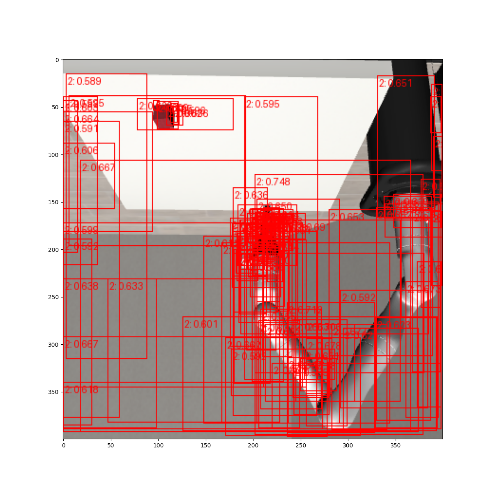

# File Structure

## ./
scripts for CNN training. Actually its a transfer/finetuning from a pretrained CNN.

## data/
dataset PennFutanPed that was used in the tutorial for finetuning
dataset Robosuite1 that is created with `sideview_image_generator.py`

### data/Robosuite1
1. Annotate with `labelme` (`pip install labelme` -- had to reinstall opencv)
2. Turn into masks with `labelme2mask` (modify directories)
3. `custom_main.py` now runs the whole thing (modify directories)

#### Results
Training for a few seconds on the 10 images produces these (rather bad) results:

